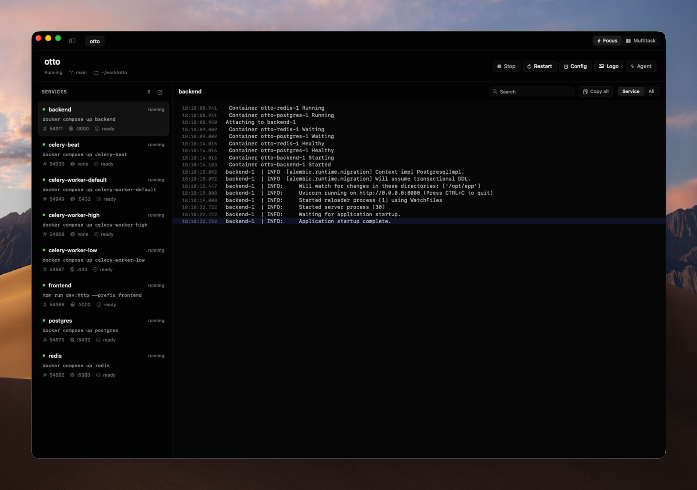

# hun

A native macOS workspace for switching projects, running services, using
terminals, viewing logs, and managing Git workflows.



[Download for Apple silicon](https://github.com/sourabhrathourr/hun/releases/latest/download/hun-macos-arm64.dmg)
· [Website](https://hun.sh)
· [Changelog](https://hun.sh/changelog)

> The macOS app is Hun's primary product. The standalone CLI and TUI remain
> available for terminal workflows, automation, and remote environments.

## What Hun does

- Switch between development projects without rebuilding your workspace.
- Start, stop, and restart project services from one native interface.
- Open terminal sessions alongside the project they belong to.
- Search live service logs without opening another terminal pane.
- Review Git changes, inspect diffs, and draft commit messages.
- Keep important controls available from the menu bar.
- Run one focused project or several projects side by side.

## Install the macOS app

Hun currently supports Apple silicon Macs running macOS 15 or later.

1. [Download the latest DMG](https://github.com/sourabhrathourr/hun/releases/latest/download/hun-macos-arm64.dmg).
2. Drag **hun** into **Applications**.
3. Open Hun from Applications.

The app is signed, notarized, and updates itself through Sparkle. It includes
the matching Hun runtime, so Homebrew, Go, and a separate CLI installation are
not required.

## How it works

The macOS app is the primary interface. It ships with the Go runtime that
manages project services and communicates with a lightweight background
daemon.

```text
macOS app ──> bundled Hun runtime ──> daemon ──> project services
                                      │
                                      ├── logs
                                      ├── ports
                                      └── state

optional CLI / TUI ───────────────────┘
```

Services run in process groups for clean termination. Logs are available in
memory for live viewing and persisted to disk with rotation. The app and
optional terminal clients use the same project configuration and daemon.

## Project configuration

Add a `.hun.yml` file to a project, or let Hun create one:

```yaml
name: my-project

services:
  frontend:
    cmd: npm run dev
    cwd: ./frontend
    port: 3000

  backend:
    cmd: go run ./cmd/server
    port: 8000
    depends_on:
      - database

  database:
    cmd: docker compose up postgres
```

Hun can detect Node.js, Go, Python, Docker Compose, and common monorepo
structures. Project files stay portable between the macOS app and CLI.

## Optional CLI and TUI

Install the standalone command-line client only if you want terminal commands,
the TUI, scripting, or a non-macOS workflow:

```sh
# Homebrew
brew tap hundotsh/tap
brew install hun

# Or install with Go
go install github.com/sourabhrathourr/hun@latest

# Or use the CLI installer
curl -fsSL https://hun.sh/install.sh | sh
```

Common commands:

```sh
hun onboard                 # Set up the first project
hun                         # Open the optional TUI
hun switch <project>        # Focus one project
hun run <project>           # Run another project alongside it
hun status                  # Inspect running services
hun logs <project>:<service>
hun doctor
```

## Development

Hun combines a SwiftUI macOS application with a Go daemon, CLI, and TUI.

```sh
make dev-macos  # Rebuild and relaunch the development app on changes
make test       # Run the Go test suite
make build      # Build the optional standalone CLI
```

See [CONTRIBUTING.md](CONTRIBUTING.md) for setup, architecture, tests, and pull
request expectations.

## Releases

Maintainers release from a clean, up-to-date `main` branch:

```sh
./scripts/release.sh --dry-run
./scripts/release.sh
```

The release command owns the macOS marketing version, build number, changelog,
release commit, and tag. GitHub Actions builds the Apple silicon app, signs and
notarizes the DMG, and publishes the GitHub release and Sparkle appcast.
Standalone CLI archives remain optional release artifacts.

## License

MIT
