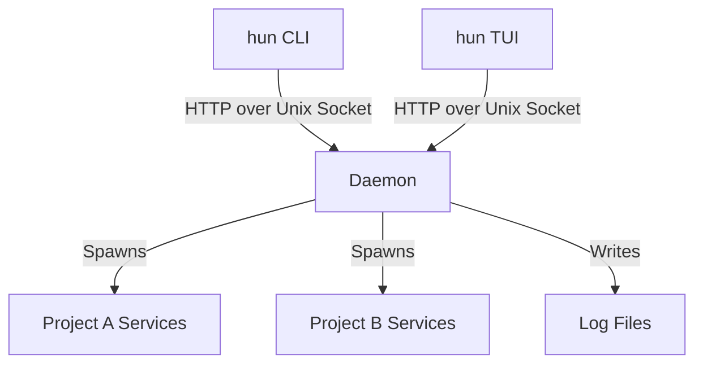

**hun** is built on a client-server model, even though it runs locally.

## The Daemon (`hun-daemon`)

The daemon is a singleton process managed by `launchd` (macOS) or `systemd` (Linux).
It is responsible for:
1.  **Process Supervision**: It spawns child processes for your services. If the CLI exits, the daemon keeps running.
2.  **State Management**: It maintains the "Source of Truth" for what is running.
3.  **Log Ring Buffer**: It keeps the last N MB of logs in memory for instant access, while flushing older logs to disk.

## Communication

The CLI and TUI talk to the Daemon via a Unix Domain Socket located at `~/.hun/daemon.sock`.
The protocol is HTTP (internal API).

## Resilience

If the daemon crashes (it shouldn't), your services will likely be orphaned or terminated by the OS depending on the process group configuration.
**hun** attempts to use process groups (PGID) to ensure clean termination of entire service trees (e.g., `npm run dev` spawning `node`).
